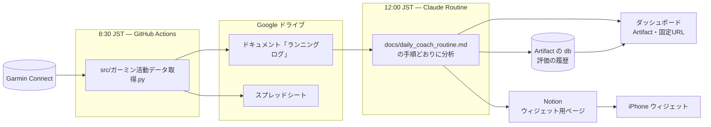

# Garmin ランニングコーチ :running:

Garmin のランニング記録と健康データを毎朝取り込み、Claude が毎日 12:00 JST に講評と次の練習を出す仕組みです。
結果はダッシュボード（claude.ai の Artifact）と iPhone のウィジェットで見ます。

> このリポジトリは [chloevoyer/garmin-to-notion](https://github.com/chloevoyer/garmin-to-notion) のフォークから始まりましたが、
> いまは Notion への同期ではなく、上記のコーチングの仕組みとして作り替えています。リポジトリ名だけが当時のままです。

## 毎日の流れ



| 時刻（JST） | 担当 | すること |
|------------|------|---------|
| 8:30 | GitHub Actions（`.github/workflows/sync_garmin_to_notion.yml`） | Garmin から走行・ラップ・睡眠・HRV などを取り、Google ドライブのドキュメントとスプレッドシートを書き換える |
| 12:00 | Claude Routine | ドキュメントを読んで講評・明日のメニュー・1週間の予定・今日の読みものを作り、ダッシュボードを更新する。評価を db に1件、ウィジェット用データを Notion に書く |
| いつでも | 自分 | ダッシュボードかウィジェットを見る。翌朝に開くと「今日のメニュー」が先頭に出る |

## どこを直せばよいか

| 変えたいこと | 直すファイル |
|-------------|-------------|
| 目標レース・目標タイム・ペースゾーン・ロードマップ | [`docs/athlete_profile.md`](docs/athlete_profile.md)（**前提条件の唯一の正**。ほかに書き写さない） |
| 講評のやり方（練習種別の判定・評価軸・出力の形） | [`docs/claude_project_running_instructions.md`](docs/claude_project_running_instructions.md) |
| Routine の手順（何を読み、何を書き、どこへ出すか） | [`docs/daily_coach_routine.md`](docs/daily_coach_routine.md) |
| ダッシュボードの見た目・グラフ | [`dashboard/index.html`](dashboard/index.html) の描画部分（DATA 以外）。PR で main に入れると翌日の更新から反映される |
| ウィジェットの見た目 | [`widget/running_widget.js`](widget/running_widget.js)（セットアップは [`widget/README.md`](widget/README.md)） |
| Garmin からの取得内容 | [`src/ガーミン活動データ取得.py`](src/ガーミン活動データ取得.py) |

矛盾があったときの優先順位は `athlete_profile.md` > `claude_project_running_instructions.md` > `daily_coach_routine.md`。

## ディレクトリ

```
.github/workflows/   毎朝の Garmin 取得（GitHub Actions）
src/                 Garmin → Google ドライブの同期本体と、その認証クライアント
scripts/             Routine が使う検証・書き出しスクリプト（*.js）と、Garmin 認証の復旧スクリプト（*.py / *.sh）
dashboard/           ダッシュボードの HTML（描画レイヤーの正。DATA は毎日の公開時に差し込む）
widget/              iPhone ウィジェット（Scriptable）
docs/                前提条件・分析手順・Routine 手順・構成・セットアップ
```

構成の詳細は [`docs/ARCHITECTURE.md`](docs/ARCHITECTURE.md)、初回の設定は [`docs/SETUP_GUIDE.md`](docs/SETUP_GUIDE.md)。

## 困ったとき

| 症状 | 見るところ |
|------|-----------|
| ダッシュボードに「データが最新ではありません」 | GitHub Actions の実行履歴。Garmin の認証で 429 が続くときは `python scripts/generate_garth_token_browser.py` でトークンを取り直し、`GARTH_TOKENS_B64` を更新する |
| ダッシュボードが昼を過ぎても更新されない | https://claude.ai/code/routines の実行履歴（承認待ちで止まっていないか） |
| ウィジェットに ⚠ が出る | [`widget/README.md`](widget/README.md) の「困ったとき」 |

## 謝辞・ライセンス

- 元になったプロジェクト: [chloevoyer/garmin-to-notion](https://github.com/chloevoyer/garmin-to-notion)
- Garmin Connect の読み出し: [cyberjunky/python-garminconnect](https://github.com/cyberjunky/python-garminconnect)

MIT License（[`LICENSE`](LICENSE)）。
