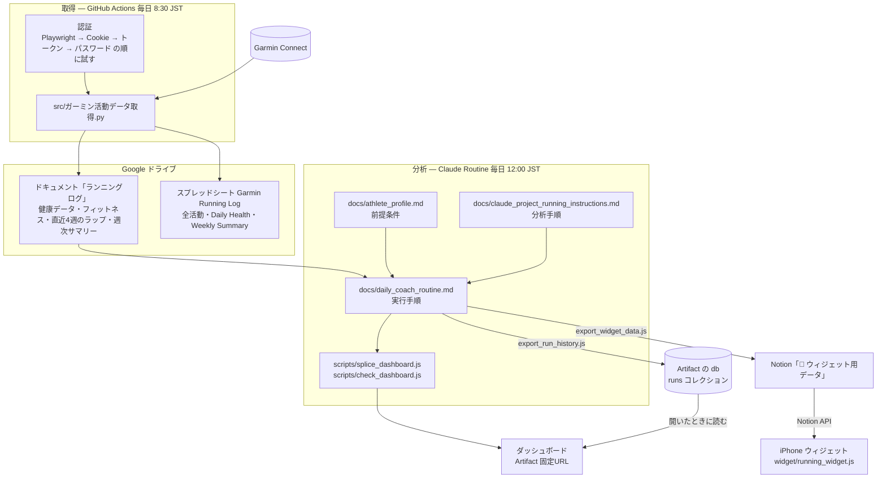

# システム構成

Garmin のデータを毎朝 Google ドライブへ取り込み、毎日 12:00 JST に Claude Routine が分析して
ダッシュボードとウィジェットへ出す。取得（GitHub Actions）と分析（Routine）を分けているのは、
Routine の実行環境から Garmin へ接続できないため（egress プロキシが `*.garmin.com` を拒否する）。

## 全体像

```mermaid
graph TD
    subgraph "取得 — GitHub Actions 毎日 8:30 JST"
        Auth[認証<br>Playwright → Cookie → トークン → パスワード の順に試す]
        Sync[src/ガーミン活動データ取得.py]
        Auth --> Sync
    end

    Garmin[(Garmin Connect)] --> Sync

    subgraph "Google ドライブ"
        Doc["ドキュメント「ランニングログ」<br>健康データ・フィットネス・直近4週のラップ・週次サマリー"]
        Sheet["スプレッドシート Garmin Running Log<br>全活動・Daily Health・Weekly Summary"]
    end
    Sync --> Doc
    Sync --> Sheet

    subgraph "分析 — Claude Routine 毎日 12:00 JST"
        Profile[docs/athlete_profile.md<br>前提条件]
        Method[docs/claude_project_running_instructions.md<br>分析手順]
        Steps[docs/daily_coach_routine.md<br>実行手順]
        Splice[scripts/splice_dashboard.js<br>scripts/check_dashboard.js]
    end
    Doc --> Steps
    Profile --> Steps
    Method --> Steps
    Steps --> Splice

    Dash[ダッシュボード<br>Artifact 固定URL]
    DB[(Artifact の db<br>runs コレクション)]
    NP[Notion「📱 ウィジェット用データ」]
    W[iPhone ウィジェット<br>widget/running_widget.js]

    Splice --> Dash
    Steps -->|export_run_history.js| DB
    Steps -->|export_widget_data.js| NP
    DB -->|開いたときに読む| Dash
    NP -->|Notion API| W
```

## 何がどこの「正」か

同じ値を2か所に持たない。持つと前提が分裂する。

| もの | 正 | 備考 |
|------|----|------|
| 目標レース・目標タイム・ペースゾーン・ロードマップ | `docs/athlete_profile.md` | ダッシュボードのシーズンの帯は `scripts/profile_season.js` がこの表を読んで差し込む |
| ダッシュボードの描画（HTML / CSS / 描画スクリプト） | リポジトリの `dashboard/index.html`（main） | Routine は毎日これを土台に DATA だけ差し替えて公開する |
| その日の分析（DATA） | 公開済みの Artifact | 毎日の DATA はコミットしない。リポジトリの DATA は古いスナップショット |
| 過去の評価（カレンダー・推移） | Artifact の db（`runs`） | 1日1件。2026-09-02 より前の距離は `BASE_KM`（`scripts/export_base_km.py`） |
| ウィジェットの表示内容 | Notion のウィジェット用ページの JSON | Routine が `scripts/export_widget_data.js` の出力で丸ごと置き換える |
| Garmin の生データ | Google ドライブのドキュメントとスプレッドシート | GitHub Actions が毎朝上書きする |

## 認証まわり

Garmin はプログラムからのログインを頻繁に制限する（429）。取得ジョブは先に Playwright のヘッドレスブラウザで
実際にログインし、セッション Cookie と活動データを取っておく（`scripts/refresh_garmin_cookies_playwright.py`。
失敗してもジョブは続く）。そのうえで本体は次の順に試す。

1. Playwright が先に取っておいた活動データ（OAuth 不要。健康データは 2 以降のクライアントで補う）
2. セッション Cookie（Playwright が保存したもの、無ければ `GARMIN_SESSION_COOKIES`）
3. `~/.garth` のトークン（Actions のキャッシュに前回分が残る）
4. `GARTH_TOKENS_B64`（OAuth トークン）
5. メールアドレスとパスワード（指数バックオフ付き）

成功したトークンは `GH_PAT_SECRETS` が設定されていれば `GARTH_TOKENS_B64` に書き戻す。
すべて失敗したときは、手元の Mac で `scripts/generate_garth_token_browser.py` などを使ってトークンを取り直す
（手順は各スクリプトの冒頭）。

## Notion について

名前に残っているとおり、もとは Garmin の記録を Notion のデータベースへ同期するプロジェクトだった。
Notion への記録は 2026-09-11 に廃止した（無人の Routine が承認待ちで止まるため）。
いま Notion を使うのは、ウィジェット用ページの全文置換1か所だけ（`.claude/settings.json` のフックで、そのページ以外への書き込みは拒否される）。

## NotebookLM / Gemini で使う場合（任意）

ドライブのドキュメントとスプレッドシートは、NotebookLM のソースや Gemini の知識として読ませることもできる。
手順は [`SETUP_GUIDE.md`](SETUP_GUIDE.md) の最後。
