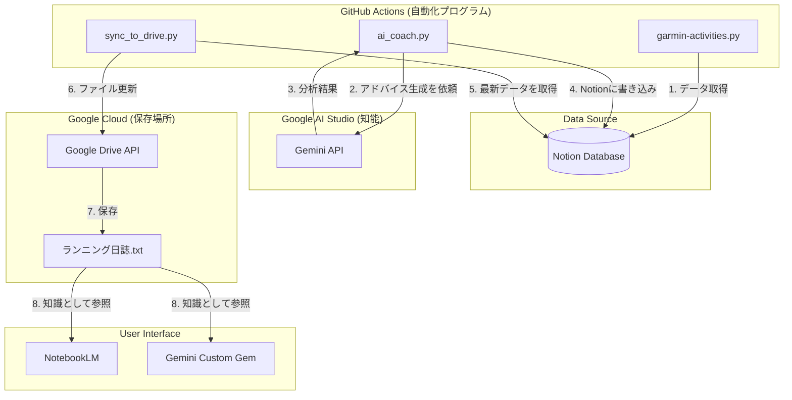

# システムアーキテクチャ解説

このプロジェクトでは、**「思考（AI）」** と **「保存（クラウド）」** で2種類のGoogleサービスを使い分けています。

## 全体像

## 1. Google AI Studio (Gemini API)
*   **役割**: **「頭脳・コーチ」**
*   **使っている場所**: `ai_coach.py`
*   **何をしているか**:
    *   過去30日間のランニングデータを受け取ります。
    *   「コーチとしての視点」でデータを分析し、褒めたりアドバイスを考えたりします。
    *   **Google Cloudの複雑な設定は不要**で、APIキー1つで手軽に「知能」を使えるのが特徴です。

## 2. Google Cloud Platform (Google Drive API)
*   **役割**: **「倉庫・ファイル管理」**
*   **使っている場所**: `sync_to_drive.py`
*   **何をしているか**:
    *   Notionのデータを、NotebookLMが読める形（テキストファイル）に変換して保存します。
    *   **NotebookLMには「APIで直接データを送る機能」がまだないため**、「Googleドライブ上のファイルを更新する」という方法で間接的に連携しています。
    *   セキュリティ（権限管理）が厳しいため、サービスアカウント（ロボット）の設定が必要でした。

## まとめ
*   **AI Coach**: Gemini APIを使って、あなたに直接アドバイスを届ける（Notion上で見る用）。
*   **Drive Sync**: Google Cloudを使って、NotebookLM/Geminiが学習するための「教科書」を作る（対話用）。

この2つが連携して、毎日のランニングをサポートするシステムになっています！🏃💨
